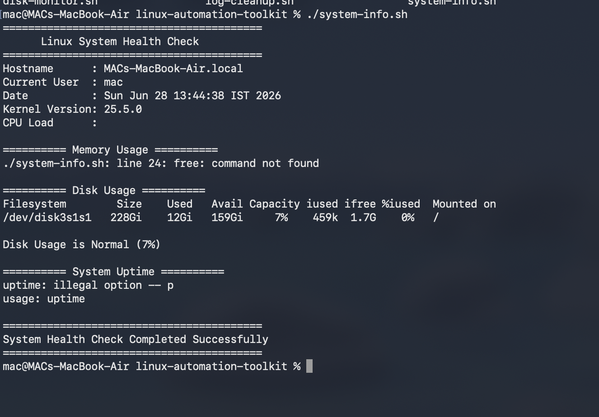
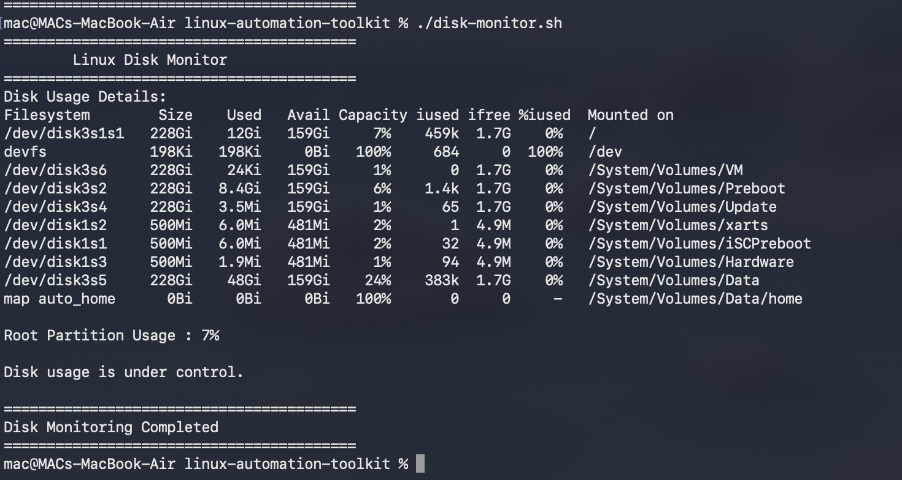
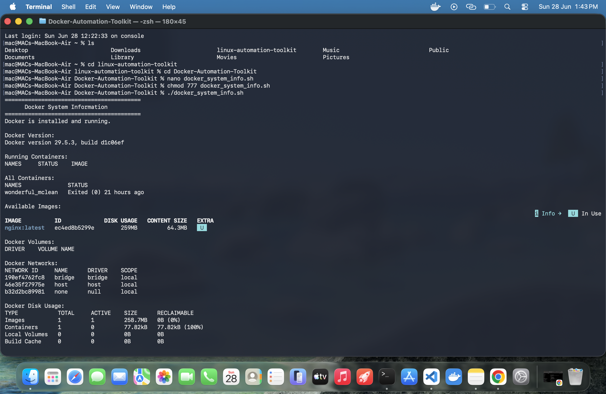
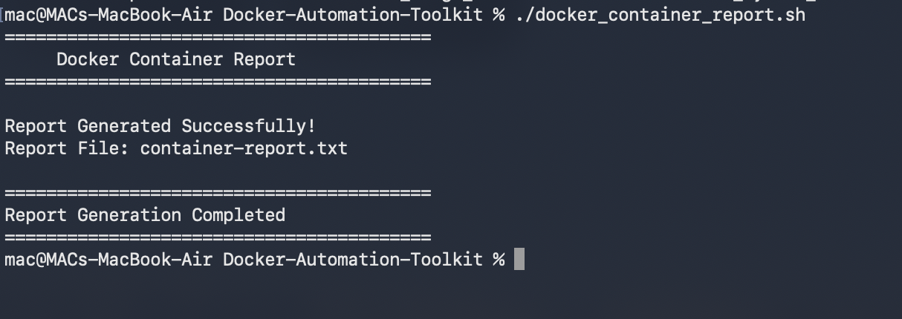
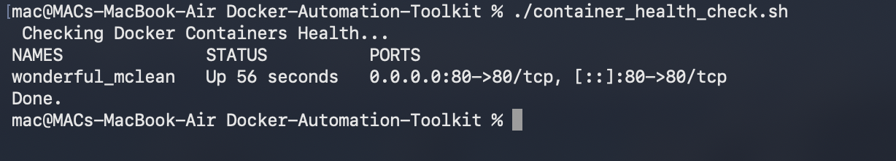

# 🚀 Linux & Docker Automation Toolkit

A collection of practical Bash automation scripts for Linux System Administration and Docker Management.

This repository demonstrates automation skills commonly used by Linux Administrators, DevOps Engineers, and Cloud Engineers.

---

## 📂 Repository Structure

```
linux-automation-toolkit/
│
├── Linux-Automation-Toolkit/
│   ├── system-info.sh
│   ├── disk-monitor.sh
│   ├── memory-monitor.sh
│   ├── cpu-monitor.sh
│   ├── service-check.sh
│   ├── backup.sh
│   ├── log-cleanup.sh
│   ├── website-monitor.sh
│   ├── user-management.sh
│   └── README.md
│
├── Docker-Automation-Toolkit/
│   ├── docker_cleanup.sh
│   ├── docker_image_builder.sh
│   ├── docker_resource_monitor.sh
│   ├── docker_volume_backup.sh
│   ├── docker_volume_restore.sh
│   ├── docker_container_report.sh
│   ├── auto_restart_container.sh
│   ├── container_health_check.sh
│   ├── image_backup.sh
│   ├── docker_stats_monitor.sh
│   ├── logs_viewer.sh
│   └── README.md
│
└── README.md
```

---

# 🐧 Linux Automation Toolkit

Automation scripts for day-to-day Linux administration tasks.

### Included Scripts

- ✅ System Information
- ✅ Disk Usage Monitor
- ✅ Memory Monitor
- ✅ CPU Monitor
- ✅ Service Status Checker
- ✅ Website Availability Monitor
- ✅ Backup Automation
- ✅ Log Cleanup
- ✅ User Management

---

# 🐳 Docker Automation Toolkit

Professional Docker automation scripts for container management.

### Included Scripts

- ✅ Docker Image Builder
- ✅ Docker Cleanup
- ✅ Docker Resource Monitor
- ✅ Docker Volume Backup
- ✅ Docker Volume Restore
- ✅ Docker Container Report
- ✅ Container Health Check
- ✅ Auto Restart Container
- ✅ Docker Stats Monitor
- ✅ Docker Image Backup
- ✅ Container Logs Viewer

---

# 🛠 Technologies Used

- Bash Shell Scripting
- Linux
- Docker
- Docker CLI
- Shell Automation
- Git
- GitHub

---

# 🎯 Skills Demonstrated

- Linux Administration
- Docker Management
- Shell Scripting
- Automation
- System Monitoring
- Backup & Restore
- Log Management
- Resource Monitoring
- Error Handling
- DevOps Fundamentals

---

# 📋 Prerequisites

- Linux / macOS
- Bash
- Docker (for Docker scripts)
- Git

---

# ▶️ Usage

Clone the repository

```bash
git clone https://github.com/mahen215/linux-automation-toolkit.git
```

Move into the project

```bash
cd linux-automation-toolkit
```

Give execute permission

```bash
chmod +x script-name.sh
```

Run

```bash
./script-name.sh
```

---

# 📈 Repository Goals

- Practice Linux Administration
- Learn Bash Automation
- Build DevOps Portfolio
- Prepare for Interviews
- Create Production-style Automation Scripts

---

# 🚀 Future Improvements

- AWS Automation Toolkit
- Kubernetes Automation Toolkit
- Jenkins Automation Toolkit
- Ansible Automation Toolkit
- Terraform Automation Toolkit

---

# 👨‍💻 Author

**Mahendar Prajapat**

Aspiring DevOps & Cloud Engineer

GitHub:
https://github.com/mahen215

Portfolio:
https://mahen-portfolio.vercel.app/

---

⭐ If you found this repository useful, consider giving it a Star.

---

# 📸 Project Screenshots

## 🐧 Linux System Information



---

## 💽 Linux Disk Monitor



---

## 🐳 Docker System Information



---

## 📊 Docker Container Report



---

## ❤️ Docker Container Health Check


